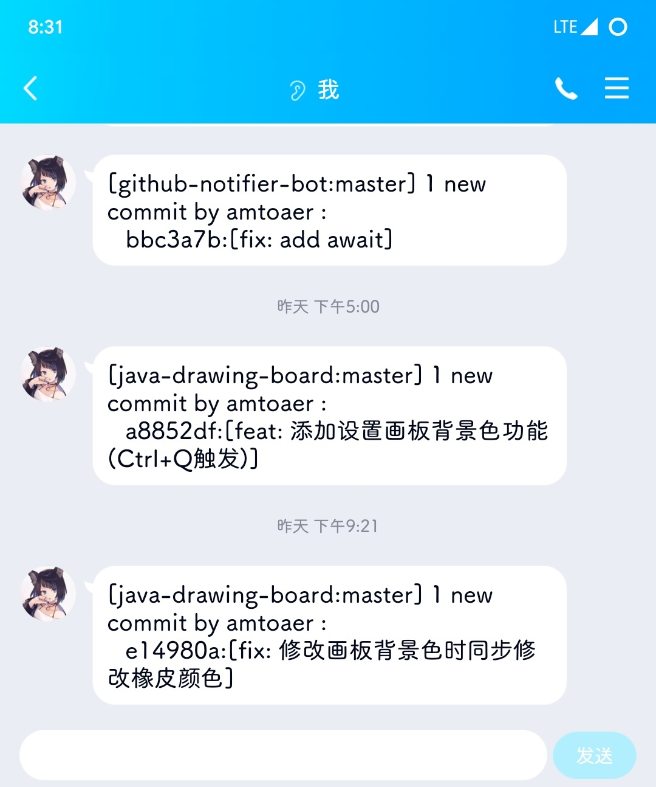

# Github Notifier Bot

## 介绍

这是一个用于通知 Github 仓库动态的机器人，基于 Mirai 与 Graia Framework 。

## 截图



## 配置

该项目包括配置文件（`config.json`），内容如下：

```json
{
  "session": {
    "host": "http://localhost:8080",
    "authKey": "your authKey",
    "account": 123456,
    "websocket": true
  },
  "port": 13579,
  "security": true,
  "token": "amtoaer",
  "mapper": {
    "amtoaer/java-drawing-board": {
      "groups": [],
      "friends": [1361974998]
    }
  }
}
```

其中`session`中包含了连接`mirai-api-http`所需的配置，内容需与`mirai-api-http`配置一致（在当前版本需确保`websocket`配置项为`true`）。

`port`是`webhook`监听的端口。

`security`标记是否使用 Github Webhook 的`secret`，`token`为`secret`的值。

`mapper`是一个`仓库全名->{群组，好友}`的映射，其中仓库全名为`{name}/{repo-name}`，群组、好友是群号、QQ 号的 List（**需要确保机器人在群组中，且机器人与好友具有好友关系**）。

## 行为

机器人会使用一个单独线程运行事件循环并使用`flask`框架监听`http://localhost:${port}/webhook`，在收到 Post 请求后，如果`security`选项为 true，该机器人会使用`token`选项加密 `payload` 并与请求头中的 sha256 值进行对比校验。校验通过后，取到 `payload` 内的有用内容生成信息，使用`payload`内的仓库信息进行`mapper`映射，得到需要发送的群组和好友列表，对其进行遍历生成协程列表，最后将协程列表发送给事件循环执行。

## 许可证

AGPL-3.0 License
